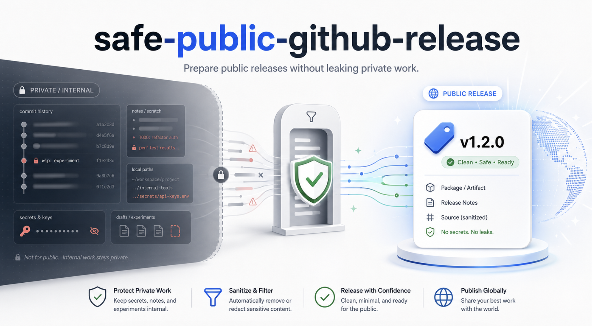

# Safe Public GitHub Release Skill

<table>
  <tr>
    <td><strong>English</strong></td>
    <td><a href="README.ja.md">日本語</a></td>
  </tr>
</table>

Codex skill for preparing clean public GitHub releases from private or
internal work without leaking private history, secrets, local paths, or
maintainer-only notes.

Use it when a release needs:

- a clean public snapshot instead of publishing private history,
- `release/vX.Y.Z` branch and PR gates,
- GitHub-rendered README approval before merge,
- release asset checks, checksums, and visibility flip verification,
- optional TestPyPI/PyPI Trusted Publishing guidance for Python tools.

## Install Locally

```bash
mkdir -p ~/.codex/skills/safe-public-github-release
rsync -a --delete skill/ ~/.codex/skills/safe-public-github-release/
```

Or run:

```bash
scripts/install-local.sh
```

The installer copies the files in `skill/` into the local Codex skills
directory. It does not change GitHub repository visibility, create tags, or
publish releases.

Then invoke it as:

```text
Use $safe-public-github-release to prepare and verify a clean public GitHub release.
```

## Repository Layout

```text
skill/                    Codex skill package
skill/SKILL.md             Main skill instructions
skill/agents/openai.yaml   UI metadata for Codex skill lists
skill/references/          Optional reference material loaded only when needed
scripts/install-local.sh   Sync this repo's skill package into the local Codex skills directory
scripts/validate_skill.py  Local validation checks
```

## What It Checks

The workflow keeps public releases conservative:

- inspect the repository, remotes, tags, workflows, and GitHub visibility first,
- scrub public-facing files for secrets, private paths, handoff notes, and
  accidental generated assets,
- use a `release/vX.Y.Z` branch and pull request before merging to `main`,
- wait for GitHub-rendered README review when release-facing docs change,
- verify tags, release assets, checksums, and downloaded artifacts before
  publication.

## Validate

```bash
python3 scripts/validate_skill.py
```

The validator checks basic skill packaging, frontmatter, UI metadata, trailing
whitespace, accidental private local paths, and obvious secret patterns.

## Release Safety Model

For a new public repository, keep the repository private until the
public-surface gate passes:

1. Prepare changes on a `release/vX.Y.Z` branch.
2. Open a pull request into `main` and let validation run.
3. Review the GitHub-rendered README.
4. Confirm the repository is still private before any tag or release work.
5. Flip visibility only after explicit maintainer approval.

Do not publish from a repository that contains private history. Use a clean
snapshot repository for public distribution.
